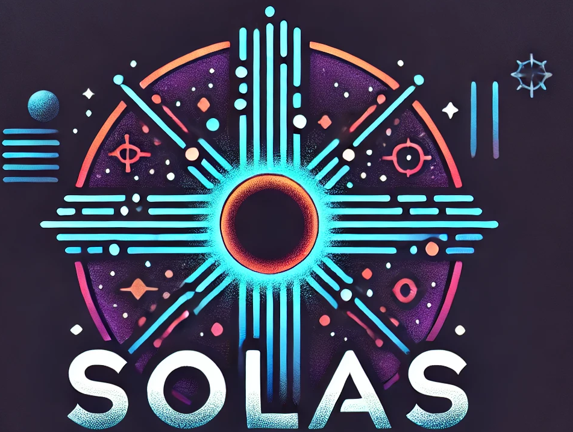

  

**SOLAS** (meaning *Light* in Irish) is an open-source ray tracing code designed to analyze emission line profiles in interacting transient events.

The code is currently in development with a  minimal viable product to be release soon -  building upon the legacy of [*escatter.py*](https://github.com/Astro-Sean/escatter).

### The Problem

Most existing tools for understanding transients rely on the assumption of spherical symmetry. However, we know this does not reflect reality; these explosions are highly asymmetric. While several codes can model these explosions, *SOLAS* aims to be the first open-source, user-friendly tool that effectively addresses the impact of asymmetries in transient events.

### Features in Development
- Trace a photon as it is emitted from a photosphere, passing through an intervening medium where it undergoes scattering, emission, and absorption events.
- Generate emission and absorption line profiles to diagnose the intervening material and, most importantly, the geometry.
- Enable an "observer" to be positioned at different orientations to diagnose light-of-sight effects.
- If you know where you photosphere is, and the denisty, distribution, and temperature of the interveening material, you can use your own models to understand a potential emergent profile.

### Contact Us
 If you would like be involved in the develop of this open-source tool - please contact [me](mailto:sean.brennan@astro.su.se).
